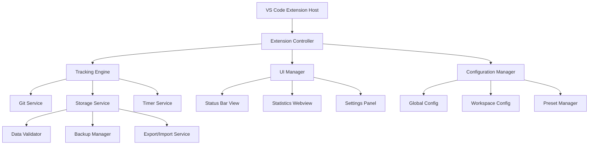

# Design Document - Branch Time Tracker v0.4.0

## Overview

Branch Time Tracker v0.4.0 introduces a modular architecture that separates concerns into distinct services and components. The design focuses on maintainability, testability, and extensibility while ensuring optimal performance and user experience. The current monolithic `extension.ts` will be refactored into a service-oriented architecture with clear separation between data management, UI components, and business logic.

## Architecture

### High-Level Architecture



### Service Layer Architecture

The extension will be organized into the following service layers:

1. **Core Services**: Fundamental functionality (Git, Storage, Timer)
2. **Business Logic**: Tracking engine and configuration management
3. **Presentation Layer**: UI components and views
4. **Data Layer**: Persistence, validation, and backup

## Components and Interfaces

### 1. Core Services

#### GitService
```typescript
interface IGitService {
    getCurrentBranch(): Promise<string | null>;
    watchBranchChanges(callback: (branch: string) => void): vscode.Disposable;
    isValidRepository(): Promise<boolean>;
    getBranchHistory(): Promise<string[]>;
}
```

**Responsibilities:**
- Git repository operations
- Branch change detection via file system watcher
- Repository validation
- Error handling for git operations

#### StorageService
```typescript
interface IStorageService {
    loadBranchTimes(): Promise<Map<string, BranchTime>>;
    saveBranchTimes(data: Map<string, BranchTime>): Promise<void>;
    createBackup(): Promise<void>;
    restoreFromBackup(): Promise<boolean>;
    validateData(data: any): boolean;
}
```

**Responsibilities:**
- Data persistence to global storage
- Automatic backup creation
- Data validation and integrity checks
- Recovery mechanisms

#### TimerService
```typescript
interface ITimerService {
    startTracking(branch: string): void;
    stopTracking(): void;
    pauseTracking(): void;
    resumeTracking(): void;
    getCurrentTime(branch: string): number;
    isTrackingPaused(): boolean;
}
```

**Responsibilities:**
- Time calculation and tracking logic
- Pause/resume functionality
- Accurate time measurement
- Memory-efficient timer management

### 2. Business Logic Layer

#### TrackingEngine
```typescript
interface ITrackingEngine {
    initialize(): Promise<void>;
    handleBranchChange(newBranch: string): Promise<void>;
    updateCurrentBranchTime(): void;
    getBranchStatistics(): BranchStatistics;
    exportData(format: ExportFormat): Promise<string>;
    importData(data: string, format: ExportFormat): Promise<void>;
}
```

**Responsibilities:**
- Orchestrates time tracking workflow
- Manages branch transitions
- Coordinates between services
- Handles export/import operations

#### ConfigurationManager
```typescript
interface IConfigurationManager {
    getGlobalSettings(): GlobalSettings;
    getWorkspaceSettings(): WorkspaceSettings;
    saveSettings(settings: Settings, scope: ConfigScope): Promise<void>;
    getActivePreset(): TrackingPreset | null;
    applyPreset(preset: TrackingPreset): Promise<void>;
    managePresets(): PresetManager;
}
```

**Responsibilities:**
- Configuration hierarchy management
- Preset creation and application
- Settings persistence
- Workspace-specific configurations

### 3. Presentation Layer

#### StatusBarView
```typescript
interface IStatusBarView {
    update(data: StatusBarData): void;
    show(): void;
    hide(): void;
    setClickHandler(handler: () => void): void;
    showLoading(): void;
    showError(message: string): void;
}
```

**Responsibilities:**
- Status bar display and updates
- Loading states and error indicators
- User interaction handling

#### StatisticsWebview
```typescript
interface IStatisticsWebview {
    show(): Promise<void>;
    update(data: StatisticsData): void;
    applyFilters(filters: StatisticsFilters): void;
    handleUserActions(): void;
    dispose(): void;
}
```

**Responsibilities:**
- Statistics display with filtering
- Interactive controls
- Real-time updates
- Export/import UI

### 4. Data Layer

#### Export/Import Service
```typescript
interface IExportImportService {
    exportToCSV(data: Map<string, BranchTime>): string;
    exportToJSON(data: ExportData): string;
    importFromCSV(csvData: string): Promise<Map<string, BranchTime>>;
    importFromJSON(jsonData: string): Promise<ExportData>;
    validateImportData(data: any, format: ExportFormat): boolean;
}
```

**Responsibilities:**
- Multiple format support (CSV, JSON)
- Data transformation and validation
- Import/export error handling

## Data Models

### Core Data Types

```typescript
interface BranchTime {
    seconds: number;
    lastUpdated: string;
    sessionCount: number;
    averageSessionTime: number;
}

interface TrackingPreset {
    id: string;
    name: string;
    description: string;
    settings: {
        updateInterval: number;
        autoRefresh: boolean;
        displayFormat: string;
        trackingEnabled: boolean;
    };
    createdAt: string;
    lastUsed: string;
}

interface ExportData {
    version: string;
    exportedAt: string;
    branchTimes: Record<string, BranchTime>;
    settings: GlobalSettings;
    metadata: {
        totalBranches: number;
        totalTime: number;
        exportFormat: ExportFormat;
    };
}

interface StatisticsFilters {
    dateRange?: {
        start: Date;
        end: Date;
    };
    branchPattern?: string;
    minTime?: number;
    maxTime?: number;
    sortBy: 'time' | 'name' | 'lastUpdated';
    sortOrder: 'asc' | 'desc';
}
```

### Configuration Schema

```typescript
interface GlobalSettings {
    updateInterval: number;
    autoRefreshEnabled: boolean;
    defaultExportFormat: ExportFormat;
    backupEnabled: boolean;
    maxBackups: number;
    theme: 'auto' | 'light' | 'dark';
}

interface WorkspaceSettings extends Partial<GlobalSettings> {
    workspaceId: string;
    projectName?: string;
    customPresets: string[];
    trackingEnabled: boolean;
}
```

## Error Handling

### Error Categories and Strategies

1. **Git Operation Errors**
   - Graceful degradation with cached data
   - Automatic retry with exponential backoff
   - User notification with actionable suggestions

2. **Storage Errors**
   - Automatic backup restoration
   - Data validation before operations
   - Fallback to in-memory storage

3. **UI Errors**
   - Error boundaries in webview components
   - Fallback UI states
   - User-friendly error messages

4. **Import/Export Errors**
   - Data validation before processing
   - Partial import recovery
   - Clear error reporting with suggestions

### Error Recovery Mechanisms

```typescript
interface ErrorRecoveryStrategy {
    canRecover(error: Error): boolean;
    recover(error: Error, context: any): Promise<boolean>;
    fallback(error: Error): void;
}

class GitErrorRecovery implements ErrorRecoveryStrategy {
    async recover(error: GitError): Promise<boolean> {
        // Implement git-specific recovery logic
        // Retry operations, use cached data, etc.
    }
}
```

## Testing Strategy

### Unit Testing
- **Coverage Target**: 80% for core services
- **Framework**: Jest with TypeScript support
- **Focus Areas**: 
  - Time calculation accuracy
  - Data validation logic
  - Configuration management
  - Export/import functionality

### Integration Testing
- **VS Code Extension Testing**: Using @vscode/test-electron
- **Git Integration**: Mock git operations for consistent testing
- **Storage Integration**: Test with temporary storage locations
- **UI Integration**: Test webview message passing

### Performance Testing
- **Memory Usage**: Monitor memory consumption over extended periods
- **Response Time**: Ensure UI operations complete within 500ms
- **Load Testing**: Test with large datasets (1000+ branches)

### Test Structure
```
tests/
├── unit/
│   ├── services/
│   ├── models/
│   └── utils/
├── integration/
│   ├── extension/
│   ├── git/
│   └── storage/
└── performance/
    ├── memory/
    └── timing/
```

## Performance Considerations

### Memory Management
- **Lazy Loading**: Load branch data on demand
- **Data Cleanup**: Regular cleanup of old branch data
- **Event Listener Management**: Proper disposal of event listeners
- **Webview Optimization**: Efficient DOM updates and data binding

### Storage Optimization
- **Incremental Saves**: Only save changed data
- **Compression**: Compress large datasets
- **Batch Operations**: Group multiple operations
- **Background Processing**: Non-blocking storage operations

### UI Performance
- **Virtual Scrolling**: For large branch lists
- **Debounced Updates**: Prevent excessive re-renders
- **Efficient Filtering**: Client-side filtering with indexing
- **Progressive Loading**: Load statistics incrementally

## Security Considerations

### Data Protection
- **Input Validation**: Sanitize all user inputs
- **Path Traversal Prevention**: Validate file paths for export/import
- **XSS Prevention**: Escape HTML content in webviews
- **Data Encryption**: Consider encryption for sensitive data

### Access Control
- **Workspace Isolation**: Prevent cross-workspace data access
- **File System Permissions**: Respect VS Code's security model
- **Extension Permissions**: Minimal required permissions

## Migration Strategy

### From v0.3.3 to v0.4.0
1. **Data Migration**: Convert existing data format to new schema
2. **Settings Migration**: Migrate global state to new configuration system
3. **Backward Compatibility**: Support reading old data formats
4. **Gradual Rollout**: Feature flags for new functionality

### Migration Steps
```typescript
interface MigrationStep {
    version: string;
    description: string;
    migrate(oldData: any): Promise<any>;
    rollback(newData: any): Promise<any>;
}

class DataFormatMigration implements MigrationStep {
    async migrate(oldData: any): Promise<any> {
        // Convert old BranchTime format to new format
        // Add new fields with default values
        // Validate migrated data
    }
}
```

## Deployment and Rollout

### Phased Deployment
1. **Phase 1**: Core refactoring and basic functionality
2. **Phase 2**: Enhanced export/import and presets
3. **Phase 3**: Advanced statistics and filtering
4. **Phase 4**: Project-specific configurations

### Feature Flags
- Enable gradual rollout of new features
- Allow rollback if issues are discovered
- A/B testing for UI improvements

### Monitoring and Telemetry
- Track extension performance metrics
- Monitor error rates and types
- Collect user feedback on new features