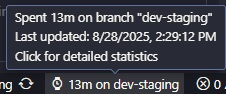
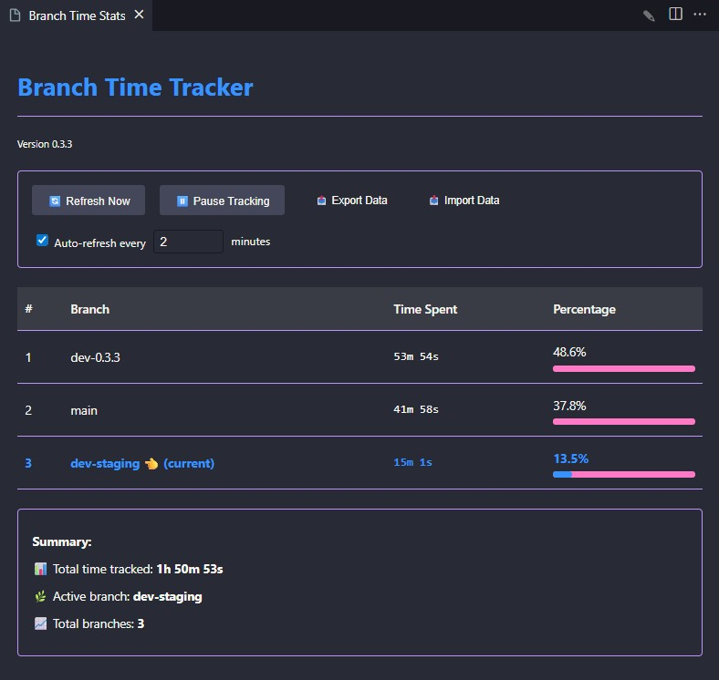

# Branch Time Tracker

Extension to track your coding time per git branch.

## Features

- Tracks time spent on each Git branch


- Mini tooltip with time spent on current branch



- Displays statistics in a dedicated tab with visual percentage bars



- Dark/light theme support
- Saves time tracking data between sessions
- Visual time distribution across branches
- Manual refresh button for up-to-date statistics
- Auto-refresh with configurable interval (1-300 seconds)
- Real-time branch time tracking

## Installation

1. Install the extension from the [VS Code Marketplace](https://marketplace.visualstudio.com/items?itemName=davidcacote.branch-time-tracker)
2. Open a Git repository in VS Code
3. The extension will automatically start tracking branch time

## Usage

- The extension automatically tracks time when you switch between branches
- Click the status bar item to open detailed statistics in a new tab
- The statistics tab shows:
  - Time spent per branch with visual percentage bars
  - Current active branch
  - Total time tracked across all branches
  - Number of branches being tracked
- Time is tracked in the background while you work

### Viewing Statistics/Report

1. Click on the time display in the status bar (e.g., "2h 30m on branch")
2. A new tab will open with detailed statistics
3. The view updates automatically when you switch branches

## Requirements

- VS Code 1.60.0 or higher
- Git installed and configured in your system PATH

## Extension Settings

This extension contributes the following settings:

- `branchTimeTracker.updateInterval`: How often to update the branch time (in milliseconds)

## 📊 Analysis & Documentation

This project includes comprehensive analysis documentation for each version:

- **[Analysis Documentation](./analysis/)** - Complete analysis of code quality, UX, and development roadmaps

## Build Process

This project includes a build system that organizes build artifacts in a `builds` directory by versions.

### Prerequisites

- Node.js (v14 or higher)
- npm (comes with Node.js)
- VS Code Extension Manager (vsce)

### Building the Extension

1. **Install Dependencies**

   ```bash
   npm install
   ```

2. **Compile TypeScript**

   ```bash
   npm run compile
   ```

   This compiles the TypeScript code to the `builds/out` directory.

3. **Package the Extension**

   ```bash
   npm run vscode:package
   ```

   This creates a VSIX file in the `builds` directory with a timestamp in the filename (e.g., `branch-time-tracker-0.3.3-20250725-224600.vsix`).

## Release Notes

### 0.3.3 (Latest)

- Memory leak prevention and performance optimizations
- Real-time branch change detection improvements
- Enhanced error handling and user feedback
- Race condition prevention in git operations

### 0.3.2

- Improved error handling for git operations
- Fixed potential memory leaks in the statistics view
- Enhanced stability and performance

### 0.3.1

- Manual refresh button in the statistics view
- Auto-refresh toggle with configurable interval
- Improved UI for refresh controls

### 0.3.0

- New tab-based statistics view with improved visualization
- Visual percentage bars for time distribution
- Dark/light theme support
- Better visual hierarchy and formatting

### 0.2.2

- Removed seconds from status bar for cleaner look
- Updated publisher information
- Fixed icon display issues

### 0.1.0-alpha

Initial alpha release with basic branch time tracking functionality.

- Automatic branch detection
- Time statistics display

For detailed changelog, see [CHANGELOG.md](./CHANGELOG.md).
