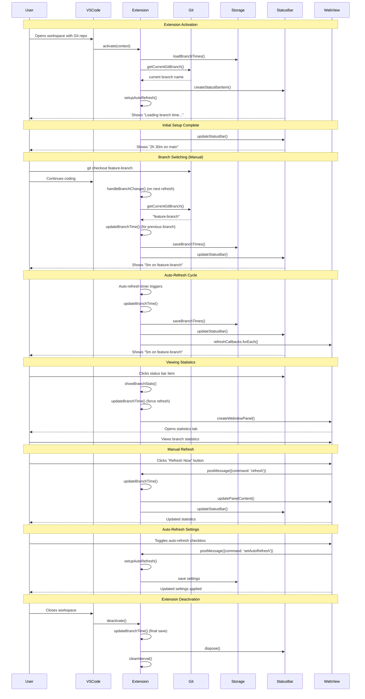
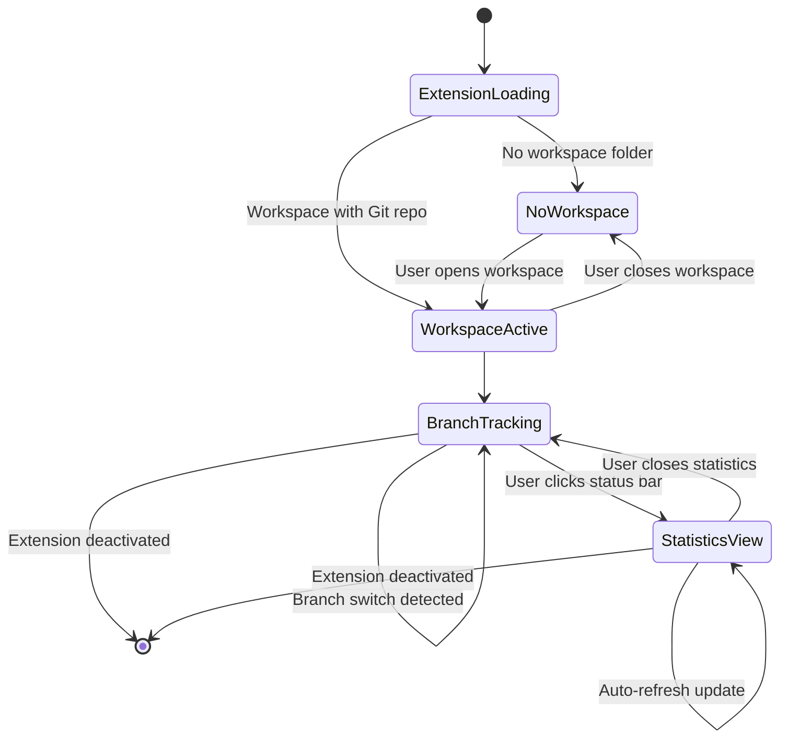
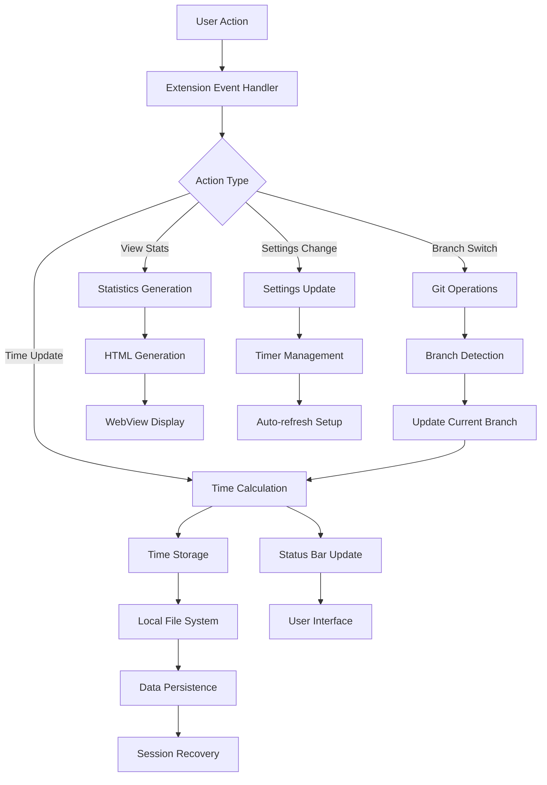
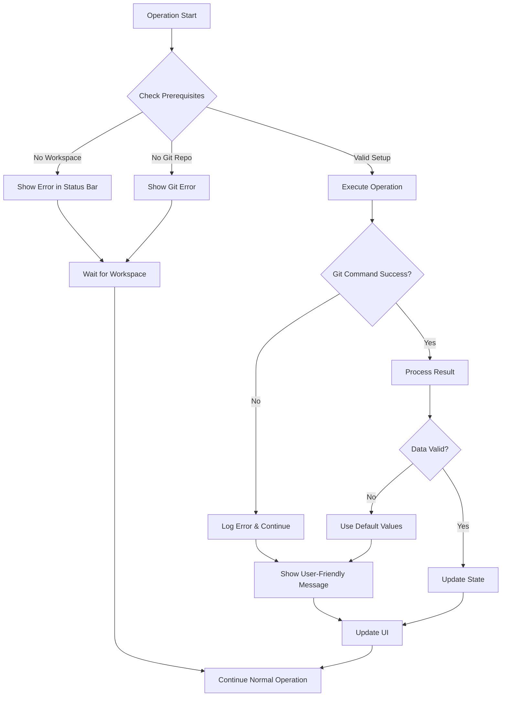

# Branch Time Tracker - Sequential UX Diagram

## User Journey Flow

## State Management Flow

## Data Flow Architecture

## Error Handling Flow

## Performance Optimization Points

1. **Timer Management**: Only run auto-refresh when workspace is active
2. **Memory Management**: Properly dispose of callbacks and timers
3. **Storage Efficiency**: Batch writes to reduce I/O operations
4. **UI Updates**: Debounce status bar updates to prevent flickering
5. **Git Operations**: Cache branch information to reduce git calls
